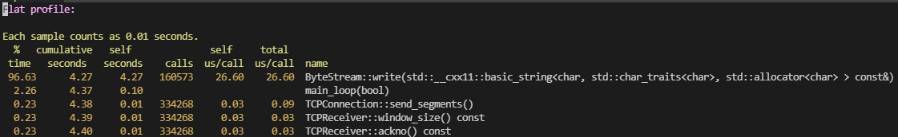

# Lab4: The TCP connection cont.

本节为「Lab4 : The TCP connection」的后续暨性能优化。本文参考了[这篇文章](https://www.cnblogs.com/kangyupl/p/stanford_cs144_labs.html)。首先，修改`sponge/etc/cflags.cmake`中的编译参数，将`-g`改为`-Og -pg`，使生成的程序具有分析程序可用的链接信息，然后编译并执行一遍`benchmark`程序，并将分析结果写入文本中：

```shell
$ make -j4
$ ./apps/tcp_benchmark 
CPU-limited throughput                : 0.34 Gbit/s
CPU-limited throughput with reordering: 0.33 Gbit/s
$ gprof ./apps/tcp_benchmark > before.txt
```

然后打开`before.txt`可以看到我的`gprof`结果：



其中`ByteStream::write`的耗时占比高居榜首，达到了惊人的96.63%，看来优化ByteStream的实现刻不容缓。我将底层的赋值逻辑从一个字符一个字符地赋值变成了一块一块地赋值，调用了`memmove`函数。优化后重新编译，再次跑一下性能测试：

```shell
$ make -j4
$ ./apps/tcp_benchmark
CPU-limited throughput                : 4.60 Gbit/s
CPU-limited throughput with reordering: 4.11 Gbit/s
```

显然，优化后取得的效果十分显著。
