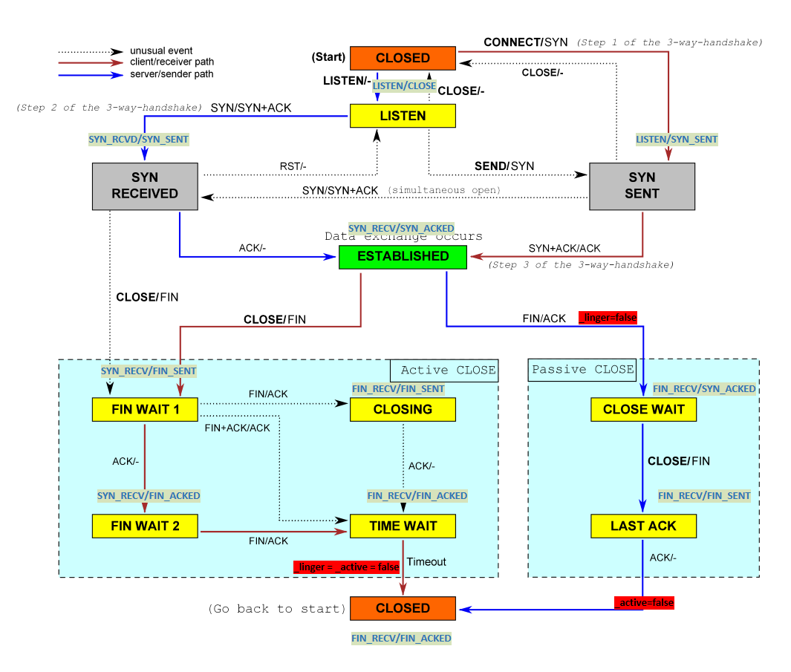

# Lab4: The TCP connection

本实验为CS144的第五个实验，应该是整个CS144中最难的实验。虽然[指导手册](https://cs144.github.io/assignments/lab4.pdf)中说

> You’ve already done most of the work to get there: you’ve implemented the sender and the receiver. Your job this week is to “wire them up” together into one object (a `TCPConnection`) and handle some housekeeping tasks that are global to the connection.

听起来很简单，但是对于我这样第一次学TCP的人来说还是很麻烦。所幸我在之前的实验中写的`TCPReceiver`及`TCPSender`的健壮性还挺不错，所以这次的实验除了给`TCPReceiver`及`TCPSender`加上了一个用来判断状态的`public`接口外，并没有修改它们的什么代码，最终有惊无险的通过了。本次实验需要深刻理解`TCPReceiver`及`TCPSender`的演化，可以在[Lab2](https://cs144.github.io/assignments/lab2.pdf)及[Lab3](https://cs144.github.io/assignments/lab3.pdf)比较靠后位置看到，图片名字分别叫 **Evolution of TCP receiver** 及 **Evolution of TCP sender**。除此之外，最重要的就是理解本文档结尾处附录中的 **TCP Connection** 的有限状态机。

## 实验环境

系统：Ubuntu20.04 LTS

机器：阿里云ECS

实例规格：ecs.t5-lc1m2.small

## Part I. TCP Connection

本次实验的重心在`TCPConnection::segment_received()`，`TCPConnection::active()`及`TCPConnection::tick()`上，其中最重要的部分就是要判断当前`TCPConnection`处于什么状态。由于`TCPConnection`可能有两种身份——`Client`或`Server`，加上12种可能的状态，这次的实验可能会比较折磨。

在这里，我先说一些手册种没有提到，但是测点会测的坑：

- 在`TCPConnection::segment_received(const TCPSegment &seg)`中需要判断该`seg`是否可以接收
  - 比如作为`Server`处于`LISTEN`状态，就不能接收不带有`SYN`的包。
  - 比如接收包的`RST`标志位为`true`，就直接重置连接，不用接收。
- 在`TCPConnection::segment_received(const TCPSegment &seg)`中，需要判断收完包是否要回复
  - 比如`local`给`remote`发了`FIN`，`remote`发回一个包ack了这个`FIN`。此时`local`就不用发包来ack这个ACK包了。因为ACK包不用也不能被ack。
- 在`TCPConnection::segment_received(const TCPSegment &seg)`中，需要判断`_active`及`_linger`是否需要修改。
- 在`TCPConnection::tick(const size_t)`中，需要准确判断是否需要彻底关闭连接（条件不只是距离上次收包时间大于等于10倍重发时间）。

实验结果可能会有随机几个 test case 跑不过（`FAILED`或是`TIMEOUT`），应该是GFW导致的。可以多试几次。

```shell
$ make check_lab4
[100%] Testing the TCP connection...
Test project /home/vector/cs144/build
        Start   1: t_wrapping_ints_cmp
  1/162 Test   #1: t_wrapping_ints_cmp ..............   Passed    0.01 sec
        Start   2: t_wrapping_ints_unwrap
  2/162 Test   #2: t_wrapping_ints_unwrap ...........   Passed    0.01 sec
        Start   3: t_wrapping_ints_wrap
  3/162 Test   #3: t_wrapping_ints_wrap .............   Passed    0.00 sec
        Start   4: t_wrapping_ints_roundtrip
  4/162 Test   #4: t_wrapping_ints_roundtrip ........   Passed    0.67 sec
        Start   5: t_recv_connect
  5/162 Test   #5: t_recv_connect ...................   Passed    0.00 sec
        Start   6: t_recv_transmit
  6/162 Test   #6: t_recv_transmit ..................   Passed    0.07 sec
        Start   7: t_recv_window
  7/162 Test   #7: t_recv_window ....................   Passed    0.01 sec
        Start   8: t_recv_reorder
  8/162 Test   #8: t_recv_reorder ...................   Passed    0.01 sec
        Start   9: t_recv_close
  9/162 Test   #9: t_recv_close .....................   Passed    0.00 sec
        Start  10: t_recv_special
 10/162 Test  #10: t_recv_special ...................   Passed    0.01 sec
        Start  11: t_send_connect
 11/162 Test  #11: t_send_connect ...................   Passed    0.00 sec
        Start  12: t_send_transmit
 12/162 Test  #12: t_send_transmit ..................   Passed    0.07 sec
        Start  13: t_send_retx
 13/162 Test  #13: t_send_retx ......................   Passed    0.01 sec
        Start  14: t_send_window
 14/162 Test  #14: t_send_window ....................   Passed    0.04 sec
        Start  15: t_send_ack
 15/162 Test  #15: t_send_ack .......................   Passed    0.01 sec
        Start  16: t_send_close
 16/162 Test  #16: t_send_close .....................   Passed    0.01 sec
        Start  17: t_send_extra
 17/162 Test  #17: t_send_extra .....................   Passed    0.01 sec
        Start  18: t_strm_reassem_single
 18/162 Test  #18: t_strm_reassem_single ............   Passed    0.01 sec
        Start  19: t_strm_reassem_seq
 19/162 Test  #19: t_strm_reassem_seq ...............   Passed    0.00 sec
        Start  20: t_strm_reassem_dup
 20/162 Test  #20: t_strm_reassem_dup ...............   Passed    0.01 sec
        Start  21: t_strm_reassem_holes
 21/162 Test  #21: t_strm_reassem_holes .............   Passed    0.01 sec
        Start  22: t_strm_reassem_many
 22/162 Test  #22: t_strm_reassem_many ..............   Passed    0.15 sec
        Start  23: t_strm_reassem_overlapping
 23/162 Test  #23: t_strm_reassem_overlapping .......   Passed    0.01 sec
        Start  24: t_strm_reassem_win
 24/162 Test  #24: t_strm_reassem_win ...............   Passed    0.15 sec
        Start  25: t_strm_reassem_cap
 25/162 Test  #25: t_strm_reassem_cap ...............   Passed    0.11 sec
        Start  26: t_byte_stream_construction
 26/162 Test  #26: t_byte_stream_construction .......   Passed    0.01 sec
        Start  27: t_byte_stream_one_write
 27/162 Test  #27: t_byte_stream_one_write ..........   Passed    0.01 sec
        Start  28: t_byte_stream_two_writes
 28/162 Test  #28: t_byte_stream_two_writes .........   Passed    0.00 sec
        Start  29: t_byte_stream_capacity
 29/162 Test  #29: t_byte_stream_capacity ...........   Passed    0.75 sec
        Start  30: t_byte_stream_many_writes
 30/162 Test  #30: t_byte_stream_many_writes ........   Passed    0.02 sec
        Start  31: t_webget
 31/162 Test  #31: t_webget .........................   Passed    1.15 sec
        Start  34: t_tcp_parser
 32/162 Test  #34: t_tcp_parser .....................   Passed    0.01 sec
        Start  35: t_ipv4_parser
 33/162 Test  #35: t_ipv4_parser ....................   Passed    0.01 sec
        Start  36: t_active_close
 34/162 Test  #36: t_active_close ...................   Passed    0.01 sec
        Start  37: t_passive_close
 35/162 Test  #37: t_passive_close ..................   Passed    0.00 sec
        Start  38: t_ack_rst
 36/162 Test  #38: t_ack_rst ........................   Passed    0.01 sec
        Start  39: t_ack_rst_win
 37/162 Test  #39: t_ack_rst_win ....................   Passed    0.00 sec
        Start  40: t_connect
 38/162 Test  #40: t_connect ........................   Passed    0.01 sec
        Start  41: t_listen
 39/162 Test  #41: t_listen .........................   Passed    0.00 sec
        Start  42: t_winsize
 40/162 Test  #42: t_winsize ........................   Passed    0.10 sec
        Start  43: t_retx
 41/162 Test  #43: t_retx ...........................   Passed    0.01 sec
        Start  44: t_retx_win
 42/162 Test  #44: t_retx_win .......................   Passed    0.01 sec
        Start  45: t_loopback
 43/162 Test  #45: t_loopback .......................   Passed    0.30 sec
        Start  46: t_loopback_win
 44/162 Test  #46: t_loopback_win ...................   Passed    0.16 sec
        Start  47: t_reorder
 45/162 Test  #47: t_reorder ........................   Passed    0.27 sec
        Start  48: t_address_dt
 46/162 Test  #48: t_address_dt .....................   Passed    0.01 sec
        Start  49: t_parser_dt
 47/162 Test  #49: t_parser_dt ......................   Passed    0.01 sec
        Start  50: t_socket_dt
 48/162 Test  #50: t_socket_dt ......................   Passed    0.01 sec
        Start  51: t_udp_client_send
 49/162 Test  #51: t_udp_client_send ................   Passed    0.27 sec
        Start  52: t_udp_server_send
 50/162 Test  #52: t_udp_server_send ................   Passed    0.25 sec
        Start  53: t_udp_client_recv
 51/162 Test  #53: t_udp_client_recv ................   Passed    0.25 sec
        Start  54: t_udp_server_recv
 52/162 Test  #54: t_udp_server_recv ................   Passed    0.26 sec
        Start  55: t_udp_client_dupl
 53/162 Test  #55: t_udp_client_dupl ................   Passed    0.27 sec
        Start  56: t_udp_server_dupl
 54/162 Test  #56: t_udp_server_dupl ................   Passed    0.26 sec
        Start  57: t_ucS_1M_32k
 55/162 Test  #57: t_ucS_1M_32k .....................   Passed    0.37 sec
        Start  58: t_ucS_128K_8K
 56/162 Test  #58: t_ucS_128K_8K ....................   Passed    0.29 sec
        Start  59: t_ucS_16_1
 57/162 Test  #59: t_ucS_16_1 .......................   Passed    0.27 sec
        Start  60: t_ucS_32K_d
 58/162 Test  #60: t_ucS_32K_d ......................   Passed    0.27 sec
        Start  61: t_ucR_1M_32k
 59/162 Test  #61: t_ucR_1M_32k .....................   Passed    0.39 sec
        Start  62: t_ucR_128K_8K
 60/162 Test  #62: t_ucR_128K_8K ....................   Passed    0.28 sec
        Start  63: t_ucR_16_1
 61/162 Test  #63: t_ucR_16_1 .......................   Passed    0.26 sec
        Start  64: t_ucR_32K_d
 62/162 Test  #64: t_ucR_32K_d ......................   Passed    0.26 sec
        Start  65: t_ucD_1M_32k
 63/162 Test  #65: t_ucD_1M_32k .....................   Passed    0.46 sec
        Start  66: t_ucD_128K_8K
 64/162 Test  #66: t_ucD_128K_8K ....................   Passed    0.29 sec
        Start  67: t_ucD_16_1
 65/162 Test  #67: t_ucD_16_1 .......................   Passed    0.27 sec
        Start  68: t_ucD_32K_d
 66/162 Test  #68: t_ucD_32K_d ......................   Passed    0.27 sec
        Start  69: t_usS_1M_32k
 67/162 Test  #69: t_usS_1M_32k .....................   Passed    0.36 sec
        Start  70: t_usS_128K_8K
 68/162 Test  #70: t_usS_128K_8K ....................   Passed    0.28 sec
        Start  71: t_usS_16_1
 69/162 Test  #71: t_usS_16_1 .......................   Passed    0.26 sec
        Start  72: t_usS_32K_d
 70/162 Test  #72: t_usS_32K_d ......................   Passed    0.27 sec
        Start  73: t_usR_1M_32k
 71/162 Test  #73: t_usR_1M_32k .....................   Passed    0.37 sec
        Start  74: t_usR_128K_8K
 72/162 Test  #74: t_usR_128K_8K ....................   Passed    0.28 sec
        Start  75: t_usR_16_1
 73/162 Test  #75: t_usR_16_1 .......................   Passed    0.26 sec
        Start  76: t_usR_32K_d
 74/162 Test  #76: t_usR_32K_d ......................   Passed    0.26 sec
        Start  77: t_usD_1M_32k
 75/162 Test  #77: t_usD_1M_32k .....................   Passed    0.47 sec
        Start  78: t_usD_128K_8K
 76/162 Test  #78: t_usD_128K_8K ....................   Passed    0.30 sec
        Start  79: t_usD_16_1
 77/162 Test  #79: t_usD_16_1 .......................   Passed    0.27 sec
        Start  80: t_usD_32K_d
 78/162 Test  #80: t_usD_32K_d ......................   Passed    0.27 sec
        Start  81: t_ucS_128K_8K_l
 79/162 Test  #81: t_ucS_128K_8K_l ..................   Passed    0.28 sec
        Start  82: t_ucS_128K_8K_L
 80/162 Test  #82: t_ucS_128K_8K_L ..................   Passed    0.59 sec
        Start  83: t_ucS_128K_8K_lL
 81/162 Test  #83: t_ucS_128K_8K_lL .................   Passed    0.54 sec
        Start  84: t_ucR_128K_8K_l
 82/162 Test  #84: t_ucR_128K_8K_l ..................   Passed    0.39 sec
        Start  85: t_ucR_128K_8K_L
 83/162 Test  #85: t_ucR_128K_8K_L ..................   Passed    0.30 sec
        Start  86: t_ucR_128K_8K_lL
 84/162 Test  #86: t_ucR_128K_8K_lL .................   Passed    0.59 sec
        Start  87: t_ucD_128K_8K_l
 85/162 Test  #87: t_ucD_128K_8K_l ..................   Passed    0.36 sec
        Start  88: t_ucD_128K_8K_L
 86/162 Test  #88: t_ucD_128K_8K_L ..................   Passed    0.56 sec
        Start  89: t_ucD_128K_8K_lL
 87/162 Test  #89: t_ucD_128K_8K_lL .................   Passed    0.57 sec
        Start  90: t_usS_128K_8K_l
 88/162 Test  #90: t_usS_128K_8K_l ..................   Passed    0.28 sec
        Start  91: t_usS_128K_8K_L
 89/162 Test  #91: t_usS_128K_8K_L ..................   Passed    0.46 sec
        Start  92: t_usS_128K_8K_lL
 90/162 Test  #92: t_usS_128K_8K_lL .................   Passed    0.47 sec
        Start  93: t_usR_128K_8K_l
 91/162 Test  #93: t_usR_128K_8K_l ..................   Passed    0.39 sec
        Start  94: t_usR_128K_8K_L
 92/162 Test  #94: t_usR_128K_8K_L ..................   Passed    0.28 sec
        Start  95: t_usR_128K_8K_lL
 93/162 Test  #95: t_usR_128K_8K_lL .................   Passed    0.53 sec
        Start  96: t_usD_128K_8K_l
 94/162 Test  #96: t_usD_128K_8K_l ..................   Passed    0.36 sec
        Start  97: t_usD_128K_8K_L
 95/162 Test  #97: t_usD_128K_8K_L ..................   Passed    0.39 sec
        Start  98: t_usD_128K_8K_lL
 96/162 Test  #98: t_usD_128K_8K_lL .................   Passed    0.58 sec
        Start  99: t_ipv4_client_send
 97/162 Test  #99: t_ipv4_client_send ...............   Passed    0.29 sec
        Start 100: t_ipv4_server_send
 98/162 Test #100: t_ipv4_server_send ...............   Passed    0.26 sec
        Start 101: t_ipv4_client_recv
 99/162 Test #101: t_ipv4_client_recv ...............   Passed    0.26 sec
        Start 102: t_ipv4_server_recv
100/162 Test #102: t_ipv4_server_recv ...............   Passed    0.27 sec
        Start 103: t_ipv4_client_dupl
101/162 Test #103: t_ipv4_client_dupl ...............   Passed    0.27 sec
        Start 104: t_ipv4_server_dupl
102/162 Test #104: t_ipv4_server_dupl ...............   Passed    0.27 sec
        Start 105: t_icS_1M_32k
103/162 Test #105: t_icS_1M_32k .....................   Passed    0.46 sec
        Start 106: t_icS_128K_8K
104/162 Test #106: t_icS_128K_8K ....................   Passed    0.30 sec
        Start 107: t_icS_16_1
105/162 Test #107: t_icS_16_1 .......................   Passed    0.27 sec
        Start 108: t_icS_32K_d
106/162 Test #108: t_icS_32K_d ......................   Passed    0.28 sec
        Start 109: t_icR_1M_32k
107/162 Test #109: t_icR_1M_32k .....................   Passed    0.44 sec
        Start 110: t_icR_128K_8K
108/162 Test #110: t_icR_128K_8K ....................   Passed    0.29 sec
        Start 111: t_icR_16_1
109/162 Test #111: t_icR_16_1 .......................   Passed    0.27 sec
        Start 112: t_icR_32K_d
110/162 Test #112: t_icR_32K_d ......................   Passed    0.27 sec
        Start 113: t_icD_1M_32k
111/162 Test #113: t_icD_1M_32k .....................   Passed    0.61 sec
        Start 114: t_icD_128K_8K
112/162 Test #114: t_icD_128K_8K ....................   Passed    0.31 sec
        Start 115: t_icD_16_1
113/162 Test #115: t_icD_16_1 .......................   Passed    0.27 sec
        Start 116: t_icD_32K_d
114/162 Test #116: t_icD_32K_d ......................   Passed    0.28 sec
        Start 117: t_isS_1M_32k
115/162 Test #117: t_isS_1M_32k .....................   Passed    0.44 sec
        Start 118: t_isS_128K_8K
116/162 Test #118: t_isS_128K_8K ....................   Passed    0.31 sec
        Start 119: t_isS_16_1
117/162 Test #119: t_isS_16_1 .......................   Passed    0.27 sec
        Start 120: t_isS_32K_d
118/162 Test #120: t_isS_32K_d ......................   Passed    0.26 sec
        Start 121: t_isR_1M_32k
119/162 Test #121: t_isR_1M_32k .....................   Passed    0.45 sec
        Start 122: t_isR_128K_8K
120/162 Test #122: t_isR_128K_8K ....................   Passed    0.29 sec
        Start 123: t_isR_16_1
121/162 Test #123: t_isR_16_1 .......................   Passed    0.27 sec
        Start 124: t_isR_32K_d
122/162 Test #124: t_isR_32K_d ......................   Passed    0.27 sec
        Start 125: t_isD_1M_32k
123/162 Test #125: t_isD_1M_32k .....................   Passed    0.62 sec
        Start 126: t_isD_128K_8K
124/162 Test #126: t_isD_128K_8K ....................   Passed    0.33 sec
        Start 127: t_isD_16_1
125/162 Test #127: t_isD_16_1 .......................   Passed    0.27 sec
        Start 128: t_isD_32K_d
126/162 Test #128: t_isD_32K_d ......................   Passed    0.29 sec
        Start 129: t_icS_128K_8K_l
127/162 Test #129: t_icS_128K_8K_l ..................   Passed    0.29 sec
        Start 130: t_icS_128K_8K_L
128/162 Test #130: t_icS_128K_8K_L ..................   Passed    0.42 sec
        Start 131: t_icS_128K_8K_lL
129/162 Test #131: t_icS_128K_8K_lL .................   Passed    0.37 sec
        Start 132: t_icR_128K_8K_l
130/162 Test #132: t_icR_128K_8K_l ..................   Passed    0.47 sec
        Start 133: t_icR_128K_8K_L
131/162 Test #133: t_icR_128K_8K_L ..................   Passed    0.30 sec
        Start 134: t_icR_128K_8K_lL
132/162 Test #134: t_icR_128K_8K_lL .................   Passed    0.53 sec
        Start 135: t_icD_128K_8K_l
133/162 Test #135: t_icD_128K_8K_l ..................   Passed    0.43 sec
        Start 136: t_icD_128K_8K_L
134/162 Test #136: t_icD_128K_8K_L ..................   Passed    0.42 sec
        Start 137: t_icD_128K_8K_lL
135/162 Test #137: t_icD_128K_8K_lL .................   Passed    0.52 sec
        Start 138: t_isS_128K_8K_l
136/162 Test #138: t_isS_128K_8K_l ..................   Passed    0.29 sec
        Start 139: t_isS_128K_8K_L
137/162 Test #139: t_isS_128K_8K_L ..................   Passed    0.40 sec
        Start 140: t_isS_128K_8K_lL
138/162 Test #140: t_isS_128K_8K_lL .................   Passed    0.55 sec
        Start 141: t_isR_128K_8K_l
139/162 Test #141: t_isR_128K_8K_l ..................   Passed    0.40 sec
        Start 142: t_isR_128K_8K_L
140/162 Test #142: t_isR_128K_8K_L ..................   Passed    0.30 sec
        Start 143: t_isR_128K_8K_lL
141/162 Test #143: t_isR_128K_8K_lL .................   Passed    0.41 sec
        Start 144: t_isD_128K_8K_l
142/162 Test #144: t_isD_128K_8K_l ..................   Passed    0.52 sec
        Start 145: t_isD_128K_8K_L
143/162 Test #145: t_isD_128K_8K_L ..................   Passed    0.51 sec
        Start 146: t_isD_128K_8K_lL
144/162 Test #146: t_isD_128K_8K_lL .................   Passed    0.44 sec
        Start 147: t_icnS_128K_8K_l
145/162 Test #147: t_icnS_128K_8K_l .................   Passed    0.16 sec
        Start 148: t_icnS_128K_8K_L
146/162 Test #148: t_icnS_128K_8K_L .................   Passed    0.21 sec
        Start 149: t_icnS_128K_8K_lL
147/162 Test #149: t_icnS_128K_8K_lL ................   Passed    0.34 sec
        Start 150: t_icnR_128K_8K_l
148/162 Test #150: t_icnR_128K_8K_l .................   Passed    0.79 sec
        Start 151: t_icnR_128K_8K_L
149/162 Test #151: t_icnR_128K_8K_L .................   Passed    0.30 sec
        Start 152: t_icnR_128K_8K_lL
150/162 Test #152: t_icnR_128K_8K_lL ................   Passed    1.23 sec
        Start 153: t_icnD_128K_8K_l
151/162 Test #153: t_icnD_128K_8K_l .................   Passed    0.73 sec
        Start 154: t_icnD_128K_8K_L
152/162 Test #154: t_icnD_128K_8K_L .................   Passed    0.28 sec
        Start 155: t_icnD_128K_8K_lL
153/162 Test #155: t_icnD_128K_8K_lL ................   Passed    1.36 sec
        Start 156: t_isnS_128K_8K_l
154/162 Test #156: t_isnS_128K_8K_l .................   Passed    1.17 sec
        Start 157: t_isnS_128K_8K_L
155/162 Test #157: t_isnS_128K_8K_L .................   Passed    0.24 sec
        Start 158: t_isnS_128K_8K_lL
156/162 Test #158: t_isnS_128K_8K_lL ................   Passed    0.34 sec
        Start 159: t_isnR_128K_8K_l
157/162 Test #159: t_isnR_128K_8K_l .................   Passed    0.59 sec
        Start 160: t_isnR_128K_8K_L
158/162 Test #160: t_isnR_128K_8K_L .................   Passed    0.29 sec
        Start 161: t_isnR_128K_8K_lL
159/162 Test #161: t_isnR_128K_8K_lL ................   Passed    3.74 sec
        Start 162: t_isnD_128K_8K_l
160/162 Test #162: t_isnD_128K_8K_l .................   Passed    1.21 sec
        Start 163: t_isnD_128K_8K_L
161/162 Test #163: t_isnD_128K_8K_L .................   Passed    0.33 sec
        Start 164: t_isnD_128K_8K_lL
162/162 Test #164: t_isnD_128K_8K_lL ................   Passed    0.54 sec

100% tests passed, 0 tests failed out of 162

Total Test time (real) =  52.64 sec
[100%] Built target check_lab4
```

再跑一下`./apps/tcp_benchmark`：

```shell
$ ./apps/tcp_benchmark
CPU-limited throughput                : 0.31 Gbit/s
CPU-limited throughput with reordering: 0.31 Gbit/s
```

显然两行都已超过了课程的最低要求“0.10Gbit/s”，但是性能还是偏低。考虑再过段时间优化一下实现。

## Part II. Webget Revisited

按照实验手册，在`webget.cc`中：

- 把`#include "socket.hh"`替换为`#include “tcp_sponge_socket.hh”`
- 把`TCPSocket`替换为`CS144TCPSocket`
- 在`get_URL()`函数的最后添加上对`CS144TCPSocket::wait_until_closed()`的调用。

在重新编译之后，运行`make check_webget`来验证我们在这门课程上实现的TCP的可用性：

```shell
$ make -j4
$ make check_webget
[100%] Testing webget...
Test project /home/vector/cs144/build
    Start 31: t_webget
1/1 Test #31: t_webget .........................   Passed    1.14 sec

100% tests passed, 0 tests failed out of 1

Total Test time (real) =   1.15 sec
[100%] Built target check_webget
```

舒服了，实现没啥问题了。

## Appendix

